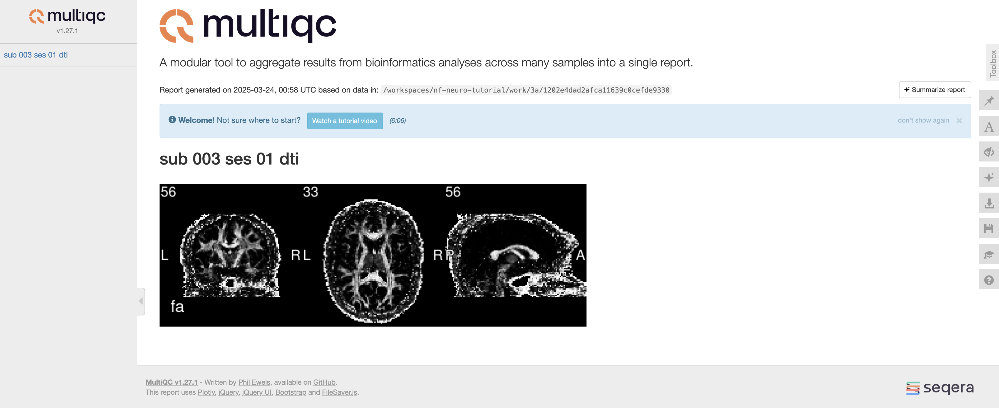
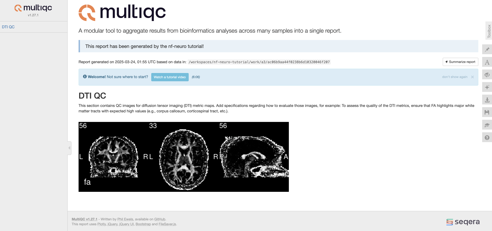

import RunIcon from '~icons/codicon/run-all';
import CloneIcon from '~icons/codicon/source-control';
import RemoteIcon from '~icons/codicon/remote';
import ExtensionsIcon from '~icons/codicon/extensions';
import CoffeeIcon from '~icons/codicon/coffee';
import WaitIcon from '~icons/ic/round-access-time';
import CommandOutputs from '../../../components/CommandOutputs.astro';
import { Steps } from '@astrojs/starlight/components';
import { Tabs, TabItem } from '@astrojs/starlight/components';

:::tip[What to expect from this walkthrough]
Once you complete this tutorial, you will be able to integrate
quality control reports into your own pipeline using the powerful
[MultiQC](https://docs.seqera.io/multiqc) tool! Users will then be able
to evaluate the results coming out from your work!
:::

Quality control in neuroimaging is an essential step to ensure good and
reproducible results, but it is often painful and requires a lot of manual
manipulation of final results. Pipelines developed within the [`nf-core`](https://nf-co.re/)
or `nf-neuro` ecosystem have access to a powerful tool to aggregate processing
results within interactive html reports: [MultiQC](https://docs.seqera.io/multiqc).
This integration allows for an easy evaluation of key processing steps for every
subjects and/or a more global evaluation (population-level) using quantitative
metrics. In this tutorial, you will see an overview of how MultiQC can integrate
your data into a clean report, and how to implement it in your own pipeline.

:::note[If you use MultiQC in your work]
Please cite their original paper:

>Ewels P, Magnusson M, Lundin S, Käller M. MultiQC: summarize analysis results
>for multiple tools and samples in a single report. Bioinformatics. 2016 Oct 
>1;32(19):3047-8. doi: [10.1093/bioinformatics/btw354](https://doi.org/10.1093/bioinformatics/btw354).
>Epub 2016 Jun 16. PMID: 27312411; PMCID: PMC5039924.

A citation to **nf-neuro** for this tutorial is also appreciated:

>Valcourt Caron A, Boré A, Edde M, Gagnon, A, Thoumyre S, Royer A, Rheault F, Descoteaux M. nf-neuro:
>Developing Maintainable Pipelines for Seamless Processing of Diffusion MRI. Proceedings of the ISMRM
>Workshop on 40 Years of Diffusion: Past, Present and Future Perspectives. 2025.
:::

## Prerequisites

You need to work on a pipeline that follows the `nf-core` conventions and have access to the [`nf-core` tools commands](https://nf-co.re/docs/nf-core-tools/).

For the purpose of this walkthrough, we will reused the completed pipeline from the tutorial [Your pipeline from A to Z](/nf-neuro/pipeline/2-tutorial_explore/).

:::caution[If you did not complete the pipeline creation tutorial]
Don't worry! You can still catch up by following the [setup section](/nf-neuro/pipeline/1-setup/).
Once you are setup, we prepared a branch that contains the complete pipeline. To access it,
checkout the `full_tutorial` branch.
```bash
git checkout full_tutorial
```
:::

## Install MultiQC module

`nf-core` have already developed a [dedicated module that runs MultiQC](https://nf-co.re/modules/multiqc/)
and create the html report containing your data. However, we first need to install it
within your pipeline, to do so, run the following command:

<CommandOutputs>
<span slot="command">
```bash
nf-core modules --git-remote https://github.com/nf-core/modules.git -b master install multiqc
```
</span>
<span slot="output">
```bash


                                          ,--./,-.
          ___     __   __   __   ___     /,-._.--~\ 
    |\ | |__  __ /  ` /  \ |__) |__         }  {
    | \| |       \__, \__/ |  \ |___     \`-._,-`-,
                                          `._,._,'

    nf-core/tools version 3.2.0 - https://nf-co.re


INFO     Installing 'multiqc'                                                                                                                                                                                                                                                                                 
INFO     Use the following statement to include this module:                                                                                                                                                                                                                                                  
                                                                                                                                                                                                                                                                                                              
 include { MULTIQC } from '../modules/nf-core/multiqc/main'                                                                                                                                                                                                                                                   

```
</span>
</CommandOutputs>

## Import MultiQC in your pipeline

Once your module is installed, you need to import it within
the `main.nf` file of your pipeline.

```groovy
include { MULTIQC } from "./modules/nf-core/multiqc/main"
```

### 1. Modify the MultiQC inputs

MultiQC was originally designed to perform quality control
on genomic data on a population level. In the neuroimaging
field, quality control is mostly done on a per-subject basis
(with sometimes a general report summarizing quantitative
data across the studied population). In this walkthrough, we
will go over the two methods to create:

<html>
<li>A **subject-specific report** allowing QC of key processing steps using
figures (e.g., registration, segmentation, etc.).</li>
<li>A **global report** for quantitative metrics across a population.</li>
</html>

Creating the global report is natively supported by MultiQC.
However, we will need to tweak the existing inputs to create the
subject-specific reports. Check the modifications needed for the `main.nf` in **./modules/nf-core/multiqc/**:

<Tabs>
<TabItem label="Before">

```groovy
input:
    path  multiqc_files, stageAs: "?/*" // Contains the files to extract data from.
    path(multiqc_config) // Configuration file for MultiQC.
    path(extra_multiqc_config) // Additional configuration file for MultiQC.
    path(multiqc_logo) // Custom logo to include in report.
    path(replace_names) // Option to replace some samples, not relevant to our case.
    path(sample_names) // Option to change sample name.
```
</TabItem>
<TabItem label="After">
```groovy
input:
    tuple val(meta), path(qc_images) // Added input with subject meta field.
    path  multiqc_files
    path(multiqc_config)
    path(extra_multiqc_config)
    path(multiqc_logo)
    path(replace_names)
    path(sample_names)
```
</TabItem>
</Tabs>

:::tip[Let's break down these changes]
As you can see, there is no metadata field that map the data to a
single subject. This will make the module run only once and generate
a single report for all subjects. To solve this issue,
we will add new input containing a subject-specific metadata field: 
`tuple val(meta), path(qc_images)`.
:::

### 2. Prefix your report with a subject specific tag

Now that we have a meta field that identifies our subjects, let's use it
to name our resulting report. To do that, we need to modify how the
`prefix` variable is defined at the beginning of the script section.
Copy this new line and replace the existing `def prefix...` in your
MultiQC module (`main.nf`).

<Tabs>
<TabItem label="Before">
```groovy
def prefix = task.ext.prefix ? "--filename ${task.ext.prefix}.html" : ''
```
</TabItem>
<TabItem label="After">
```groovy
def prefix = "--filename ${meta.id}_multiqc_report"
```
</TabItem>
</Tabs>

### 3. Change MultiQC container

We also want to change the container to use the [official docker container](https://hub.docker.com/r/multiqc/multiqc)
for MultiQc.

<Tabs>
<TabItem label="Before">
```groovy
    container "${ workflow.containerEngine == 'singularity' && !task.ext.singularity_pull_docker_container ?
        'https://depot.galaxyproject.org/singularity/multiqc:1.27--pyhdfd78af_0' :
        'biocontainers/multiqc:1.27--pyhdfd78af_0' }"
```
</TabItem>
<TabItem label="After">
```groovy
    container "${ 'multiqc/multiqc:v1.27.1' }"
```
</TabItem>
</Tabs>

### 4. Add a label to the process execution

Finally, we want to tag each execution of the module using this `meta.id` tag.
To do so, let's add a `tag "$meta.id"` at the top of the process definition (`main.nf`).

<Tabs>
<TabItem label="Before">
```groovy
process MULTIQC {
    label 'process_single'

    <...>
}

```
</TabItem>
<TabItem label="After">
```groovy
process MULTIQC {
    tag "$meta.id"
    label 'process_single'

    <...>
}
```
</TabItem>
</Tabs>

Your MultiQC module is now up-and-running for our neuroimaging needs!

## Create a subject MultiQC report

:::note[If you do not already have QC within your modules]
The instructions for how to create QC files within your modules have
been deeply covered in the [create your own module tutorial](/nf-neuro/contribute/create-your-module/2-main/#including-quality-control-qc-steps-within-your-module).
The current section will assume QC is already available within your
modules, and will cover how to generate and collect QC files during
pipeline execution. 
:::

Preferably, QC files (either images or tabular-like files) should be
generated within your module and enabled using a flag that can be passed
using the `task.ext` arguments. In the tutorial pipeline, we are performing
simple operations to obtain FA values within gray matter (GM), white matter (WM),
and cerebrospinal fluid (CSF) masks. To ensure we obtain good results, we
should look at the FA map and validate they do not contain any artifact.
Luckily, the `RECONST_DTIMETRICS` module already includes a QC section, producing
screenshots of the generated metrics map. We will leverage this to create our
first section of our individual-level MultiQC report.

### 1. Collect QC files

<Steps>

1. To collect the QC files during pipeline execution we need to create an
empty channel at the beginning of the workflow file. This empty channel will
be populated when the modules output QC files. Add this line at the beginning
of the workflow section in your `./main.nf` file.
    ```groovy
    ch_multiqc_files = Channel.empty()
    ```

2. Since `RECONST_DTIMETRICS` is nested within the `PREPROC_DIFF` subworkflow,
we also need to collect the files within the subworkflow to make them accessible
in the main workflow. Identical to the step above, define an empty channel at the
top of your `PREPROC_DIFF` `./subworkflows/local/preproc_diff/main.nf`, right below the `main:` section.
    ```groovy
    ch_multiqc_files = Channel.empty()
    ```

3. Once all of our empty channels are defined, we can start populating them!
If you look at the outputs of `RECONST_DTIMETRICS` (either in the [API documentation](/nf-neuro/api/modules/reconst/dtimetrics)
or directly in the `main.nf`), you will see an emitted channel called `mqc`. This
channel contains the QC files generated within the module. Let's append this
channel to our previously empty channel.
    <Tabs>
    <TabItem label="Before">
    ```groovy
    // DTI-derived metrics
    RECONST_DTIMETRICS( input_dti )
    ```
    </TabItem>
    <TabItem label="After">
    ```groovy
    // DTI-derived metrics
    RECONST_DTIMETRICS( input_dti )
    ch_multiqc_files = ch_multiqc_files.mix(RECONST_DTIMETRICS.out.mqc)
    ```
    </TabItem>
    </Tabs>

4. We now need to output this `ch_multiqc_files` from the subworkflow to
make it accessible on the workflow level. We will add a new output in the `emit:`
section of the `PREPROC_DIFF` subworkflow.
    <Tabs>
    <TabItem label="Before">
    ```groovy
    emit:
        dwi                 = ch_dwi_bvalbvec.dwi           // channel: [ val(meta), dwi-raw ]
        dwi_denoised        = DENOISING_MPPCA.out.image     // channel: [ val(meta), dwi-after-mppca ]
        bvs_files           = ch_dwi_bvalbvec.bvs_files     // channel: [ val(meta), bval, bvec ]
        fa                  = RECONST_DTIMETRICS.out.fa     // channel: [ val(meta), fa ]
        md                  = RECONST_DTIMETRICS.out.md     // channel: [ val(meta), md ]
    ```
    </TabItem>
    <TabItem label="After">
    ```groovy
    emit:
        dwi                 = ch_dwi_bvalbvec.dwi           // channel: [ val(meta), dwi-raw ]
        dwi_denoised        = DENOISING_MPPCA.out.image     // channel: [ val(meta), dwi-after-mppca ]
        bvs_files           = ch_dwi_bvalbvec.bvs_files     // channel: [ val(meta), bval, bvec ]
        fa                  = RECONST_DTIMETRICS.out.fa     // channel: [ val(meta), fa ]
        md                  = RECONST_DTIMETRICS.out.md     // channel: [ val(meta), md ]
        mqc                 = ch_multiqc_files              // channel: [ val(meta), mqc ]
    ```
    </TabItem>
    </Tabs>

5. We have now setup the structure to collect QC files and deliver them to
the main workflow file. However, generating the QC files within `RECONST_DTIMETRICS`
is optional (as it is for all modules that have QC within `nf-neuro`). To actually
produce the QC files during runtime, we need to change the `ext.qc` argument to
`true`. In the `nextflow.config` file, locate the `ext.qc` argument, and replace
`false` with `true`. We will also enable some of the other metrics to create a more meaningful
QC report.
    <Tabs>
    <TabItem label="Before">
    ```groovy
    withName: "RECONST_DTIMETRICS" {
        ext.ad = false
        ext.evecs = false
        ext.evals = false
        ext.fa = true
        ext.ga = false
        ext.rgb = false
        ext.md = true
        ext.mode = false
        ext.norm = false
        ext.rd = false
        ext.tensor = false
        ext.nonphysical = false
        ext.pulsation = false
        ext.residual = false
        ext.b0_thr_extract_b0 = 10
        ext.dwi_shell_tolerance = 50
        ext.max_dti_shell_value = 1200
        ext.run_qc = false
    }
    ```
    </TabItem>
    <TabItem label="After">
    ```groovy
    withName: "RECONST_DTIMETRICS" {
        ext.ad = true
        ext.evecs = false
        ext.evals = false
        ext.fa = true
        ext.ga = false
        ext.rgb = false
        ext.md = true
        ext.mode = false
        ext.norm = false
        ext.rd = true
        ext.tensor = false
        ext.nonphysical = false
        ext.pulsation = false
        ext.residual = false
        ext.b0_thr_extract_b0 = 10
        ext.dwi_shell_tolerance = 50
        ext.max_dti_shell_value = 1200
        ext.run_qc = true
    }
    ```
    </TabItem>
    </Tabs>

    :::caution[Custom content within MultiQC]
    By default, MultiQC will integrate files matching a `*mqc.{png,gif,...}` pattern
    located in the current directory. If you use modules from `nf-neuro`,
    all your QC files should contain this required pattern. However, if you develop
    new QC elements, make sure to either include this suffix in your filenames, or
    [view the official MultiQC documentation for custom content.](https://docs.seqera.io/multiqc/custom_content)
    :::

6. Final step before being ready to supply those files to the MultiQC module is
to append the QC files from the `PREPROC_DIFF` subworkflow to the `ch_multiqc_files`
in the main workflow (`./main.nf`). We will use the same approach as step 3 above.
    <Tabs>
    <TabItem label="Before">
    ```groovy
    //Processing DWI
    PREPROC_DIFF( inputs.dwi )
    ```
    </TabItem>
    <TabItem label="After">
    ```groovy
    //Processing DWI
    PREPROC_DIFF( inputs.dwi )
    ch_multiqc_files = ch_multiqc_files.mix(PREPROC_DIFF.out.mqc)
    ```
    </TabItem>
    </Tabs>

</Steps>

### 2. Supply QC files to MultiQC

Now that the QC files are accessible in the main workflow, we can supply those
files to the MultiQC module. However, we need to format the channel to make
it in a way the module expects it to be. The following steps will go through this
formatting and include the module in the main workflow.

<Steps>
1. In the previous section, we appended our QC files to a single channel using
the [**`.mix`**](https://www.nextflow.io/docs/latest/reference/operator.html#mix)
Nextflow operator. This operator works similarly to how we append items
to a list in python and returns a single list of files. When we have multiple
subjects, this means the files from a single subject are not necessarily grouped
together. Since we do not want to mix up our subjects in our MultiQC report, we
will use the [**`.groupTuple`**](https://www.nextflow.io/docs/latest/reference/operator.html#grouptuple)
operator. Since all of our files are tagged with metadata (under the `meta` value),
this will group every files with identical metadata, ensuring we do not have mixed
up reports. Finally, as we saw in the [MultiQC inputs](#multiqc-inputs) section,
the module expect a `tuple val(meta), path(files)`. To make sure we respect this input
definition, we will flatten the files into a single list. Add the following
lines at the end of our main workflow definition:

    :::note[For more information on Nextflow's operators]
    Here, we briefly describe the use of `.mix` and `.groupTuple` operators. A more
    extensive description with examples can be seen in the [official Nextflow
    documentation](https://www.nextflow.io/docs/latest/reference/operator.html).
    :::

    <Tabs>
    <TabItem label="Channel reformatting">
    ```groovy
    ch_multiqc_files = ch_multiqc_files
        .groupTuple()
        .map { meta, files_list -> 
            def files = files_list.flatten().findAll { it != null }
            return tuple(meta, files)
        }
    ```
    </TabItem>
    </Tabs>

2. Once the channel is properly reformatted, we can safely set it as input to
our MultiQC module. Since we already imported the module at the top of the `./main.nf`
file, we can simply call it, and fill the [MultiQC inputs](#1-modify-the-multiqc-inputs) with
empty list if we do not have them.

    <Tabs>
    <TabItem label="Calling MultiQC">
    ```groovy
    MULTIQC(
        ch_multiqc_files,
        [],
        [],
        [],
        [],
        [],
        []
    )
    ```
    </TabItem>
    </Tabs>

3. <RunIcon class="inline-icon dark:text-blue-300 text-blue-500" aria-hidden /> **Now, you can run nextflow..**

   <CommandOutputs>
   <span slot="command">
    ```bash
    nextflow run main.nf --input data -profile docker -resume
    ```
   </span>
   <span slot="output">
    ```bash
    N E X T F L O W   ~  version 24.10.4

    Launching `main.nf` [irreverent_shaw] DSL2 - revision: aa9a350f39

    [31/3d8beb] PREPROC_DIFF:DENOISING_MPPCA (sub-003_ses-01)    [100%] 1 of 1, cached: 1 ✔
    [b6/47c33f] PREPROC_DIFF:RECONST_DTIMETRICS (sub-003_ses-01) [100%] 1 of 1, cached: 1 ✔
    [fe/618dca] PREPROC_T1:DENOISING_NLMEANS (sub-003_ses-01)    [100%] 1 of 1, cached: 1 ✔
    [53/503632] PREPROC_T1:BETCROP_SYNTHBET (sub-003_ses-01)     [100%] 1 of 1, cached: 1 ✔
    [bb/f19643] STATS_METRICSINROI (sub-003_ses-01)              [100%] 1 of 1, cached: 1 ✔
    [43/e595d3] MULTIQC (sub-003_ses-01)                         [100%] 1 of 1, cached: 1 ✔
    ```
   </span>
   </CommandOutputs>

   Your resulting MultiQC report should look similar to this:

   

    As you can see, there isn't much in the report for now other than our generated
    screenshot. Hopefully, we can customize this section to add proper heading, description, 
    etc.

    :::tip[Making the best out of MultiQC!]
    The MultiQC report contains multiple builtin functionalities that can help you
    evaluate and explore your data. For a detailed overview, please see the [official
    documentation!](https://docs.seqera.io/multiqc/reports)
    :::
</Steps>

### 3. Customize your MultiQC report

We have now learned how to collect QC files, supply them to MultiQC, and generate a
per-subject report. However, our report is not really informative as it does not contain
any heading or description for our QC image. This can be solved using a custom MultiQC
config file. This section will provide detailed instructions to create your own config
file.

<Steps>

1. Create a `./assets/multiqc_config.yml` file.

    ```bash
    mkdir assets
    touch assets/multiqc_config.yml
    ```

2. Let's start by adding a general comment to describe the origin of the MultiQC report.
This is done by adding a `report_comment` section at the top of the config file.

    ```yaml
    report_comment: >
      This report has been generated by the nf-neuro tutorial!
    ```

3. Then, we can define the order of our future section, starting with a `dti_qc` section
that will contain our FA QC image.

    ```yaml
    report_section_order:
      dti_qc:
        order: -1001
    ```

4. It is now time to add our `custom_data` section. This is where we will define
the title of our section containing our FA QC image and its description. 

    ```yaml
    custom_data:
        dti_qc:
        file_format: "png"
        section_name: "DTI QC"
        description: |
            This section contains QC images for diffusion tensor imaging (DTI) metric
            maps. Add specifications regarding how to evaluate those images, for example:
            To assess the quality of the DTI metrics, ensure that FA highlights major white
            matter tracts with expected high values (e.g., corpus callosum, corticospinal tract, etc.)...
        plot_type: "image"
    ```

    :::tip[Section examples!]
    To facilitate and harmonize section descriptions across pipelines derived from
    `nf-neuro`, we supply example description sections for each module type containing
    builtin QC. You can see the list in the `multiqc_config.yml` file in the [`nf-neuro`
    repository](https://github.com/scilus/nf-neuro/blob/main/assets/multiqc_config.yml).
    :::

5. In order for MultiQC to fetch the right files for each section, you need to specify which
pattern to use to match your files for this specific section. This can be done using the `sp` item.

    ```yaml
    sp:
      dti_qc:
        fn: "*dti_mqc.png"
    ```

    You should now have your complete `multiqc_config.yml` file! It should look similar to this:

    <Tabs>
    <TabItem label="Expected multiqc_config.yml">
    ```yaml
    report_comment: >
      This report has been generated by the nf-neuro tutorial!

    report_section_order:
      dti_qc:
        order: -1001

    custom_data:
      dti_qc:
        file_format: "png"
        section_name: "DTI QC"
        description: |
          This section contains QC images for diffusion tensor imaging (DTI) metric
          maps. Add specifications regarding how to evaluate those images, for example:
          To assess the quality of the DTI metrics, ensure that FA highlights major white
          matter tracts with expected high values (e.g., corpus callosum, corticospinal tract, etc.)...
        plot_type: "image"

    sp:
      dti_qc:
        fn: "*dti_mqc.png"
    ```
    </TabItem>
    </Tabs>

6. The final step consists of supplying this QC file to your MultiQC module. To fetch
external files, you can use the [`Channel.fromPath()` channel factory](https://www.nextflow.io/docs/latest/reference/channel.html#frompath)
combined with the [`$projectDir` variable](https://www.nextflow.io/docs/latest/reference/stdlib.html)
available in the standard Nextflow library. Let's fetch the config file and supply it to the MultiQc module.
Change your `./main.nf` file.

    <Tabs>
    <TabItem label="Before">
    ```groovy
    // MultiQC
    MULTIQC(
        ch_multiqc_files,
        [],
        [],
        [],
        [],
        [],
        []
    )
    ```
    </TabItem>
    <TabItem label="After">
    ```groovy
    ch_multiqc_config = Channel.fromPath("$projectDir/assets/multiqc_config.yml", checkIfExists: true)

    // MultiQC
    MULTIQC(
        ch_multiqc_files,
        [],
        ch_multiqc_config.toList(),
        [],
        [],
        [],
        []
    )
    ```
    </TabItem>
    </Tabs>

7. <RunIcon class="inline-icon dark:text-blue-300 text-blue-500" aria-hidden /> **Now, you can run nextflow..**

   <CommandOutputs>
   <span slot="command">
    ```bash
    nextflow run main.nf --input data -profile docker -resume
    ```
   </span>
   <span slot="output">
    ```bash
    N E X T F L O W   ~  version 24.10.4

    Launching `main.nf` [compassionate_kimura] DSL2 - revision: dbd86e4af5

    executor >  local (1)
    [63/c712f5] PRE…_DIFF:DENOISING_MPPCA (sub-003_ses-01) | 1 of 1, cached: 1 ✔
    [b1/101edf] PRE…FF:RECONST_DTIMETRICS (sub-003_ses-01) | 1 of 1, cached: 1 ✔
    [fe/618dca] PRE…_T1:DENOISING_NLMEANS (sub-003_ses-01) | 1 of 1, cached: 1 ✔
    [53/503632] PRE…C_T1:BETCROP_SYNTHBET (sub-003_ses-01) | 1 of 1, cached: 1 ✔
    [d7/c9806a] STATS_METRICSINROI (sub-003_ses-01)        | 1 of 1, cached: 1 ✔
    [c5/0eaffa] MULTIQC (sub-003_ses-01)                   | 1 of 1 ✔
    ```
   </span>
   </CommandOutputs>

   Your newly generated MultiQC report should now look like this:

   

    As you can see, the report is now much cleaner and informative!

</Steps>

## Create a global MultiQC report

As described above, you can also create a single report containing quantitative
metrics across all subjects. This is particularly useful to single out outliers
needing further quality control. **This section will be coming soon!**