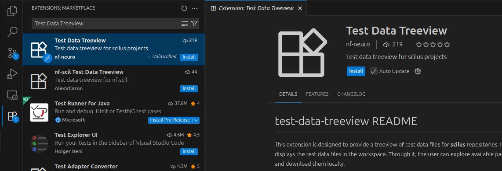
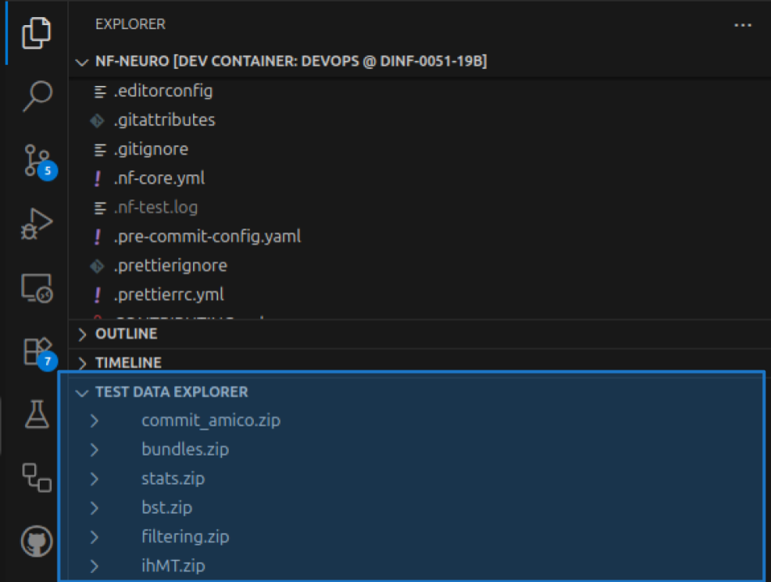
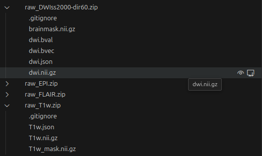

import { Steps } from '@astrojs/starlight/components';
import { Tabs, TabItem } from '@astrojs/starlight/components';
import ExtensionsIcon from '~icons/codicon/extensions';
import ViewIcon from '~icons/codicon/eye';
import DownloadIcon from '~icons/codicon/desktop-download';

nf-neuro provides an **infrastructure to host and distribute test data, freely available to all
contributors**. This infrastructure is composed of three elements :

<Steps>
1. A **webserver** hosting data packages, **versioned using the [DVC](https://dvc.org/) framework**.
2. A **Nextflow subworkflow**, [LOAD_TEST_DATA](/nf-neuro/api/subworkflows/load_test_data), 
   that downloads, caches and unpacks those data packages.
3. A **VS Code extension**, [Test Data Explorer](https://marketplace.visualstudio.com/items?itemName=nf-neuro.test-data-treeview),
   to browse test data packages, inspect their content and download them.
</Steps>

## **Test Data Explorer** extension

<span class="text-blue-400">**[If working in the _devcontainer_, the extension is already installed and setup for you]**</span> Else,
go to the <ExtensionsIcon class="inline-icon text-blue-300" aria-hidden /><span class="text-blue-300">Extension Marketplace</span>
and install it. You'll find the extension under the name **_Test Data Treeview_**.



Once installed, a **new tab section will appear in the <span class="text-blue-400">Explorer Panel</span>**.



Click on the **arrow icon** on the right of an archive name to show its content. _You might have to wait a bit for the
archive to download locally_.



**Hovering on a file name** will display some options to interact with it :

- You can <ViewIcon class="inline-icon text-blue-300" aria-hidden /><span class="text-blue-300">Display the files content</span>
  in the <span class="text-blue-300">VSCode Editor Area</span>.
  - VSCode will select the **best suited editor depending on the file type**.
  - For example, **Nifti images** are opened **in the 3D viewer** [Niivue](https://marketplace.visualstudio.com/items?itemName=KorbinianEckstein.niivue).
- You can <DownloadIcon class="inline-icon text-blue-300" aria-hidden /><span class="text-blue-300">Copy the file</span>
  from cache to any location on your machine.

### Usage outside of nf-neuro

By default, the extension is configured to work with the content of the nf-neuro repository. However, **you can alter its configuration
and use it to browse data organized in archives from any repository**. You only need two things for the extension to work :

<Steps>
1. A **webserver** hosting the data archives and exposing them as `http` links.
2. A **json file** listing the archives and location on the webserver.
</Steps>

The json file contains a single object, **a dictionary** with archives' names as keys and their location on the webserver as values :

```json
{
  "archive1": "path/to/archive1.zip",
  "archive2": "path/to/archive2.zip"
}
```

**For flexibility, the base URI of the webserver is not hardcoded in the file, but provided as a VSCode setting**. Use the configuration
options below :


| Setting | Description | Default |
| - | - | - |
| **testDataExplorer.dataserver**           | Base URI to the data server (without protocol)                                          |
| **testDataExplorer.serverdatalocation**   | Subpath to the data location on the server <br />(will be append to the dataserver URI) |
| **testDataExplorer.localListingLocation** | Path to the local JSON file listing the archives                                        |

## **LOAD_TEST_DATA** subworkflow

The [LOAD_TEST_DATA](/nf-neuro/api/subworkflows/load_test_data) subworkflow not only downloads and unpacks test data archives, but also
**caches them locally** to prevent unnecessary re-downloads and preserve bandwidth. To use it, include it in your **_main.nf_** subworkflow
file or **_main.nf.test_** test file :

<Tabs>
<TabItem label="Subworkflow main.nf">

```groovy
include { LOAD_TEST_DATA } from '../load_test_data/main'
```
</TabItem>
<TabItem label="Subworkflow main.nf.test">
```groovy
include { LOAD_TEST_DATA } from '../../load_test_data/main'
```
</TabItem>
<TabItem label="Module main.nf">
```groovy
include { LOAD_TEST_DATA } from '../../../../subworkflows/nf-neuro/load_test_data/main'
```
</TabItem>
<TabItem label="Module main.nf.test">
```groovy
include { LOAD_TEST_DATA } from '../../../../../subworkflows/nf-neuro/load_test_data/main'
```
</TabItem>
</Tabs>

**The workflow has two inputs** :

<Steps>
1. **A channel** containing a list of package names to download.
2. **A name for the temporary directory** where the data will be put.
</Steps>

To call it, use the following syntax :

```groovy
archives = Channel.from( [ "<archive1>", "<archive2>", ... ] )
LOAD_TEST_DATA( archives, "<directory>" )
```

:::tip
To get a view of available archives, use the [Test Data Explorer](#test-data-explorer-extension) extension. **Archive
names can be derived from the names displayed in the extension, or from the [json file](https://github.com/scilus/nf-neuro/tree/main/tests/test_data.json)
listing the archives** (this file is also available locally if you are in the **nf-neuro repository**).
:::

:::caution
This will download the `archives` in **_sub-directories_ defined by their name**,
under the **_directory_ specified as input**.
:::

The archives contents are accessed using the output parameter of the workflow
`LOAD_TEST_DATA.out.test_data_directory`. To define actual **test inputs** from
it, use the `.map` operator :

```groovy
input = LOAD_TEST_DATA.out.test_data_directory
  .map{ test_data_directory -> [
    [ id:'test', single_end:false ], // meta map
    file("${test_data_directory}/<file for input 1>"),
    file("${test_data_directory}/<file for input 2>"),
    ...
  ] }
```

Then, feed it to your subworkflow as follows :

<Tabs>
<TabItem label='Subworkflow "preproc_A"'>
```groovy
preproc_A( input )
```
</TabItem>
<TabItem label='Module "DENOISING_ALGOA"'>
```groovy
DENOISING_ALGOA( input )
```
</TabItem>
</Tabs>
