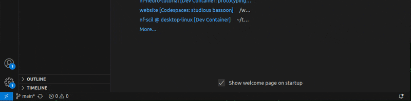
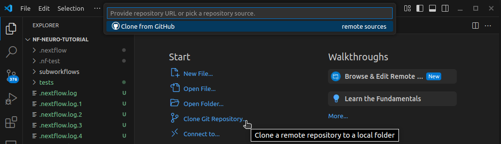
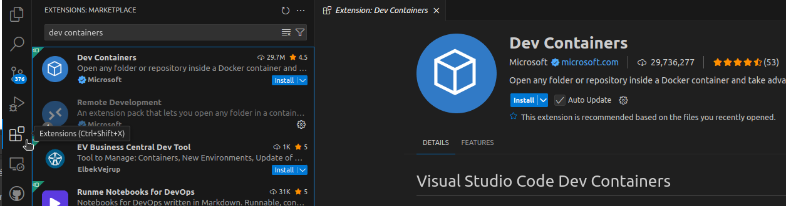
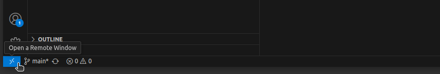
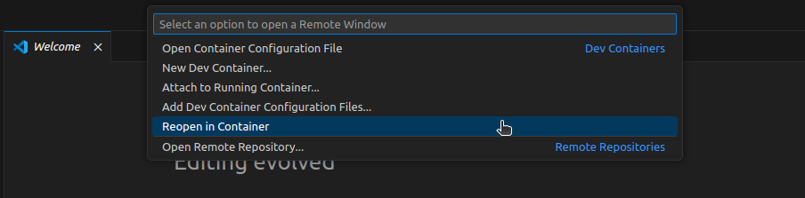
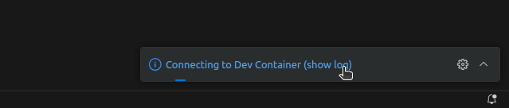
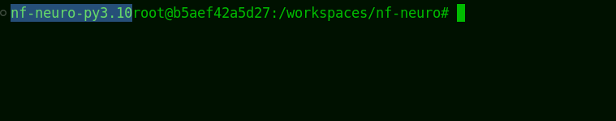

import CloneIcon from '~icons/codicon/source-control';
import RemoteIcon from '~icons/codicon/remote';
import ExtensionsIcon from '~icons/codicon/extensions';
import CoffeeIcon from '~icons/codicon/coffee';
import WaitIcon from '~icons/ic/round-access-time';
import CommandOutputs from '../../../components/CommandOutputs.astro';
import { Steps } from '@astrojs/starlight/components';
import { Tabs, TabItem } from '@astrojs/starlight/components';

:::tip[What to expect from this walkthrough]
Once you complete this setup procedure, you will own a fully fledge environment
in **VSCode**, configured with [nextflow](https://nextflow.io),
the [nf-core](https://nf-co.re) tools suites, and the developper tools
[nf-test](https://nf-test.com), [prettier](https://prettier.io),
[editorconfig](https://editorconfig.org), all ready for
[nf-neuro](https://github.com/scilus/nf-neuro) modules and subworkflows
development.
:::

## Quick setup : VSCode and **devcontainers**

The fastest way to start coding is with [VSCode](https://code.visualstudio.com) (&geq; 1.95)
and [docker](https://www.docker.com/get-started/) (&geq; 24).

<Steps>

1. If you don't have **VSCode** or **docker** installed yet, do it using the links provided above.

2. Open **VSCode**. If it opens in a project, close it or open a **new empty window** (`ctrl+shift+N`).

3. Open the **VSCode terminal**. For that, you can either **pull on the VSCode window footer** or
   use the `` ctrl+shift+` `` keyboard shortcut (you will find the `` ` `` key left to the `Enter` key).

   

4. Test that you have access to **docker**. In the `VSCode Terminal`, run :

   <CommandOutputs>
   <span slot="command">
   ```bash
   docker run hello-world
   ```
   </span>
   <span slot="output">
   ```
   Unable to find image 'hello-world:latest' locally
   latest: Pulling from library/hello-world
   e6590344b1a5: Pull complete 
   Digest: sha256:bfbb0cc14f13f9ed1ae86abc2b9f11181dc50d779807ed3a3c5e55a6936dbdd5
   Status: Downloaded newer image for hello-world:latest

   Hello from Docker!

   This message shows that your installation appears to be working correctly.
   To generate this message, Docker took the following steps:
   1. The Docker client contacted the Docker daemon.
   2. The Docker daemon pulled the "hello-world" image from the Docker Hub.
       (amd64)
   3. The Docker daemon created a new container from that image which runs the
       executable that produces the output you are currently reading.
   4. The Docker daemon streamed that output to the Docker client, which sent it
       to your terminal.
   To try something more ambitious, you can run an Ubuntu container with:

   $ docker run -it ubuntu bash

   Share images, automate workflows, and more with a free Docker ID:
   https://hub.docker.com/
   For more examples and ideas, visit:
   https://docs.docker.com/get-started/
   ```
   </span>
   </CommandOutputs>

   :::tip[Can't connect to the daemon socket]
   If you get an error, either the **docker daemon** is not running or you need to
   setup some permissions to access it. Follow [these instructions](https://docs.docker.com/engine/install/linux-postinstall/#manage-docker-as-a-non-root-user),
   then get back here !
   :::

</Steps>

### Install nf-neuro

Next step is to **install nf-neuro** locally. 

<Steps>

1. In you VSCode window, find <CloneIcon class="inline-icon text-blue-300" aria-hidden />
   <span class="text-blue-300">Clone git repository</span> under the **Start** main menu.
   Clicking on it opens the **command palette** at the top of the window.

   

2. Select **Clone from Github** and login if asked.

   :::tip
   The **command palette** now transforms to a search bar into repositories available on Github.
   :::

3. Search and select **scilus/nf-neuro**. Set a download location for the repository
   when asked, anywhere is fine.

4. Wait for a prompt to **open** the cloned repository directory in the current VSCode window.

</Steps>

### Development container

It will take only a few seconds for the editor to load up, but you don't have access to the
**development environment** to its full extent yet. For that, you need the `devcontainer`.

<Steps>

1. Install the <span class="text-blue-300">Dev Containers</span> extension. You'll
   find it in the <ExtensionsIcon class="inline-icon text-blue-300" aria-hidden />
   <span class="text-blue-300">Extension Marketplace</span>, located in the navigation bar on the left.

   
   
2. Locate and click on the <span class="text-blue-300">Remote Window Menu</span> icon
   <RemoteIcon class="inline-icon hover:bg-blue-400" aria-hidden /> at the bottom left
   corner of the **VSCode** window. The **command palette** at the trop of the window.

   

3. Find the <span class="text-blue-300">Reopen in Container</span> option and click it.

   

4. There you will have a choice of container to build. **Select devops**.

5. Wait a few minutes for the container to build. <span class="hover:text-yellow-700">It's
   a good time for a hot drink <CoffeeIcon class="inline-icon" aria-hidden /></span>.

   :::tip
   It will appear as nothing much happens in the VSCode window. To show the container
   build logs, click on the tooltip displayed at the bottom right corner of the screen.

   
   :::

</Steps>

:::note
Once you get access to your files through the editor, you might want to wait a little longer.
Some extensions may still be installing and some features of the development environment not
available yet, indicated by a <WaitIcon class="inline-icon text-blue-300" aria-hidden />
<span class="text-blue-300">wait icon</span> over the <ExtensionsIcon class="inline-icon" aria-hidden />
**extension marketplace**.
:::

## Working in the `devcontainer`

Once in the container, you'll notice that, well, not much has changed in fact !

<Tabs>
<TabItem label="Explorer panel">
The whole content of the **custom pipeline template** you cloned locally on your computer is accessible
through the <span class="text-blue-300">Explorer panel</span> on the left.
</TabItem>
<TabItem label="Editor area">
Clicking on any file in the <span class="text-blue-300">Explorer panel</span> will open it in the
**Editor area**. Its content is the same locally and in the container. When you modify it inside the
container and save the file (`ctrl+s`), changes apply instantly on your computer.
</TabItem>
<TabItem label="Terminal">
The **terminal** is still located at the bottom of the window. Thugging at VSCode window's footer will
open it, or you can use the `` ctrl+shift+` `` shortcut. There, you have access to tools installed **inside
the container**, like <span class="text-blue-300">nextflow</span>, <span class="text-blue-300">nf-core</span>, 
<span class="text-blue-300">nf-test</span> and <span class="text-blue-300">docker</span>.
</TabItem>
</Tabs>

### Sanity checks

Let's verify that tools are available and working by running some quick and simple tests commands.

<Steps>

1. Open a **VSCode terminal** (pulling on the window's footer or with the `` ctrl+shift+` ``
   shortcut, `` ` `` is on the left of the enter key). 

2. In the terminal, every command should have a **specific prefix**, added by `poetry`, which
   means your **python environment** is valid. Nothing required, but if its not the case, open
   an issue, you've hit a bug !

   

2. **nf-core/tools**

   <CommandOutputs>
   <span slot="command">
   ```bash
   nf-core modules list remote
   ```
   </span>
   <span slot="output">
   Check the command's header, above the list of modules, you should see this info message :

   ```bash frame="none"      
   INFO    Modules available from https://github.com/scilus/nf-neuro.git (main)
   ```

   Verify that the link you got is the same as above.
   </span>
   </CommandOutputs>

3. **docker**

   <CommandOutputs>
   <span slot="command">
   ```bash
   docker run hello-world
   ```
   </span>
   <span slot="output">
   ```
   Unable to find image 'hello-world:latest' locally
   latest: Pulling from library/hello-world
   e6590344b1a5: Pull complete 
   Digest: sha256:bfbb0cc14f13f9ed1ae86abc2b9f11181dc50d779807ed3a3c5e55a6936dbdd5
   Status: Downloaded newer image for hello-world:latest

   Hello from Docker!

   This message shows that your installation appears to be working correctly.
   To generate this message, Docker took the following steps:
   1. The Docker client contacted the Docker daemon.
   2. The Docker daemon pulled the "hello-world" image from the Docker Hub.
       (amd64)
   3. The Docker daemon created a new container from that image which runs the
       executable that produces the output you are currently reading.
   4. The Docker daemon streamed that output to the Docker client, which sent it
       to your terminal.
   To try something more ambitious, you can run an Ubuntu container with:

   $ docker run -it ubuntu bash

   Share images, automate workflows, and more with a free Docker ID:
   https://hub.docker.com/
   For more examples and ideas, visit:
   https://docs.docker.com/get-started/
   ```
   </span>
   </CommandOutputs>

3. **Nextflow**

   <CommandOutputs>
   <span slot="command">
   ```bash
   nextflow run helloworld
   ```
   </span>
   <span slot="output">
   Check the command's output, you've been greeted in 4 different languages
   (english, french, italian, spanish) !

   ```bash
   N E X T F L O W   ~  version 24.10.4

   Pulling nextflow-io/helloworld ...
   downloaded from https://github.com/nextflow-io/hello.git
   Launching `https://github.com/nextflow-io/helloworld` [disturbed_mahavira] DSL2 - revision: afff16a9b4 [master]

   executor >  local (4)
   [59/71fa40] process > sayHello (4) [100%] 4 of 4 ✔
   Bonjour world!

   Hello world!

   Ciao world!

   Hola world!
   ```
   </span>
   </CommandOutputs>

4. **nf-test**
   :::note
   This test is longer, but quite effective at verifying all tools communicate well together. You'll
   have to wait around 5 minutes, for it pull docker containers and run, maybe more depending on your
   internet connection speed. <span class="hover:text-yellow-700">Enough time to finish your hot drink
   <CoffeeIcon class="inline-icon" aria-hidden /></span> !
   :::

   <CommandOutputs>
   <span slot="command">
   ```bash
   nf-test test modules/nf-neuro/reconst/dtimetrics --profile docker
   ```
   </span>
   <span slot="output">
   ```
   ? nf-test 0.9.2
   https://www.nf-test.com
   (c) 2021 - 2024 Lukas Forer and Sebastian Schoenherr

   Load .nf-test/plugins/nft-nifti/0.0.1/nft-nifti-0.0.1.jar

   Test Process RECONST_DTIMETRICS

   Test [4ab7ab0c] 'reconst - stub-run dtimetrics' PASSED (7.152s)


   SUCCESS: Executed 1 tests in 7.159s
   ```
   </span>
   </CommandOutputs>

</Steps>
