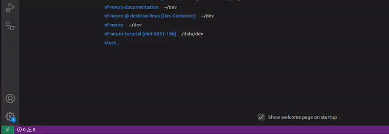
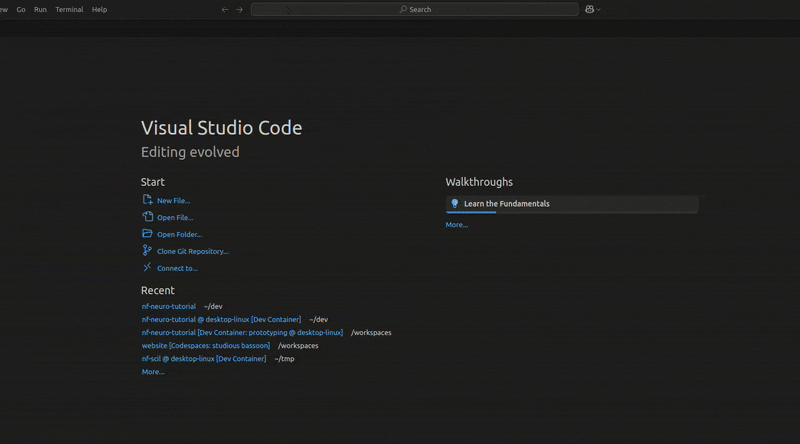
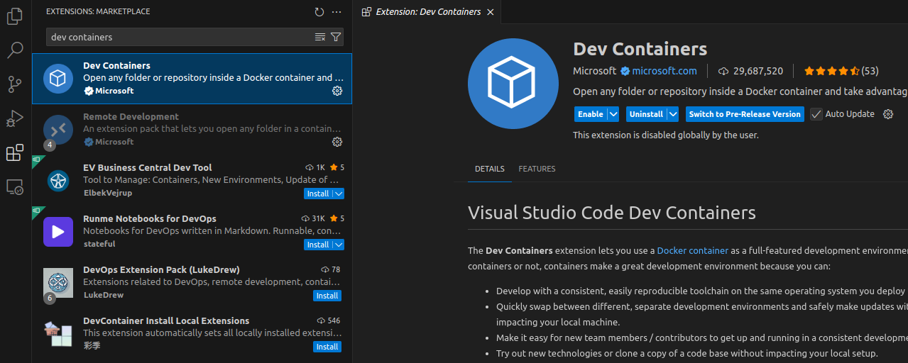

import CloneIcon from '~icons/codicon/source-control'
import RemoteIcon from '~icons/codicon/remote'
import ExtensionsIcon from '~icons/codicon/extensions'
import CoffeeIcon from '~icons/codicon/coffee'
import WaitIcon from '~icons/ic/round-access-time'

## Quick setup : VSCode and **devcontainers**

### Prerequisites

The fastest way to start coding is by installing [VSCode](https://code.visualstudio.com) (&geq; 1.95)
and [Docker](https://www.docker.com/get-started/) (&geq; 24). Once done, open **VSCode**. If it opens
in a project, close it or open a **new empty window** (`ctrl+shift+N`). Then, test that you have access
to **docker**. In the `VSCode Terminal`, run :

```bash
docker run hello-world
```



:::tip[Can't connect to the daemon socket]
If you get an error, either the **docker daemon** is not running or you need to
setup some permissions to access it. Follow [these instructions](https://docs.docker.com/engine/install/linux-postinstall/#manage-docker-as-a-non-root-user),
then get back here !
:::

### Custom pipeline template

Next step is to `clone` the **custom pipeline template**. In you VSCode window, find
<CloneIcon class="inline-icon text-blue-300" aria-hidden /> <span class="text-blue-300">Clone git repository</span>
under the **Start** main menu. Clicking on it opens the **command palette** at the top of the window. There, select
**Clone from Github** and login if asked.



The **command palette** now transforms to a search bar into repositories available on Github.
**Search and select** `scilus/nf-neuro-tutorial`. Set a download location for the repository
when asked, anywhere is fine. Wait for a prompt to **open** the cloned repository directory
in the current VSCode window.

### Development container

It will take only a few seconds for the editor to load up, but you don't have access to the
**development environment** to its full extent yet. For that, you need the `devcontainer`.
First thing, install the <span class="text-blue-300">Dev Containers</span> extension. You'll
find it in the <ExtensionsIcon class="inline-icon text-blue-300" aria-hidden />
<span class="text-blue-300">Extension Marketplace</span>, located in the navigation bar on the left.



Once installed, it adds the options we need in the <RemoteIcon class="inline-icon hover:bg-blue-400" aria-hidden />
<span class="text-blue-300">Remote Window Menu</span>. You'll find it in the bottom
left corner of the window. Clicking on it opens the **command palette**. The option
you're looking for is <span class="text-blue-300">Reopen in Container</span>. Wait a few
minutes for the container to build. <span class="hover:text-yellow-700">It's a good time
for a hot drink <CoffeeIcon class="inline-icon" aria-hidden /></span>.

:::note
Once you get access to your files through the editor, you might want to wait a little longer.
Some extensions may still be installing and some features of the development environment not
available yet, indicated by a <WaitIcon class="inline-icon text-blue-300" aria-hidden />
<span class="text-blue-300">wait icon</span> over the <ExtensionsIcon class="inline-icon" aria-hidden />
**extension marketplace**.
:::

## Working in the `devcontainer`

Once in the container, you'll notice that, well, not much has changed in fact ! You still have
access to the content of the **custom pipeline template** in the <span class="text-blue-300">
Explorer</span> area on the left. Clicking on content will open them in the **Editor** and you
still have access to the **terminal** at the bottom of the window. You can access the **command
palette** using the shortcut `ctrl+shit+P`, which is loaded with useful commands available in
the **development environment**.

### Sanity checks

About the **terminal**, open one (pulling on the window's footer or with the `` ctrl+shift+` ``
shortcut, `` ` `` is on the left of the enter key). Let's verify that tools are available and
working by running some quick and simple tests commands.

#### nf-core/tools

```bash
nf-core modules list remote
```

Check the command's header, above the list of modules, you should see this info message :

```bash frame="none"      
INFO    Modules available from https://github.com/scilus/nf-neuro.git (main)
```

#### Docker

```bash
docker run hello-world
```

Check the command's output, it should be the same as when you run the command from outside the container.

#### Nextflow

```bash
nextflow run helloworld
```

Verify the **nextflow-io/helloworld** pipeline is pulled successuflly. Check the command's output,
you've been greeted in 4 different languages (english, french, italian, spanish) !

#### nf-test

```bash
nf-test test modules/nf-neuro/reconst/dtimetrics -profile docker
```

This test is longer, but quite effective at verifying all tools communicate well together. You'll
have to wait around 5 minutes for it pull docker containers and run. <span class="hover:text-yellow-700">
Enough time to finish your hot drink <CoffeeIcon class="inline-icon" aria-hidden /></span> !

On completion, check the command output, it should end with <span class="text-emerald-400">SUCCESS</span>
and all test cases labeled as <span class="text-emerald-400">PASSED</span>.

### Nextflow language server

In the `devcontainer`, you get access to all tools to get coding in **Nextflow** right away. The most
important tool for development is the **Nextflow Language Server**, which is enabled in all parts of the
VSCode editor by the container. In the <span class="text-blue-300">Explorer</span>, click on the `main.nf`
file located at the root of the workspace.

Once it opens in the <span class="text-blue-300">editor area</span>, hover above the various line of codes.
When possible, tooltips will display, giving relevant information on the item hovered above. Tooltips for
items from the **official nextflow language** will display an aditional <span class="text-blue-300">Read More</span>
link its **online documentation**, useful to understand how they work.

### Accessing your data

In the `devcontainer`, you have access to everything located **inside your workspace**. For you, this means
everything that comes bundled in the `scilus/nf-neuro-tutorial` repository. You can call commands to look
outside this directory, like `ls /` or `ls ~`, but you won't find what is on your computer. This is called
**isolation** and is a core feature of containers. It does limit you, but it also means that
you can break things (like deleting everything under `/`) without breaking your computer.

Good news though, there is ways to give access to your data to the container. If your dataset is small
enough, the simpler way is to **copy it** in the nf-neuro-tutorial repository directory. When you launch
the `devcontainer` from a directory, VSCode **automatically connects it the workspace in the container**.
This way, any modifications made from your computer reflect instantly inside the container (and
vice-versa). However, for larger dataset, this would be impractical. For that, there are 2 ways :

#### Mounting paths in the devcontainer

Instead of copying and duplicating data, you can define a **new mount point** in the devcontainer
definition. You will find it in `.devcontainer/devcontainer.json`. Look for the **mounts** entry,
near <span class="text-blue-300">line 15</span>. To define a mount point add the following in the
mounts entry :

```json
{
    "source": "<source>",
    "target": "/workspaces/<target>",
    "type": "bind"
}
```

Replace <span class="text-blue-300">\<source\></span> by the **absolute path** to the data
on your computer and <span class="text-blue-300">\<target\></span> with the name of the directory
you'd like your data to be placed inside the container, under `/workspaces`.

:::caution
Your **identity** changes inside the container. If the location of the data on your computer is **user
restricted**, for instance a mounted share accessible with your username, you might not have access to
it inside the container.
:::

#### Piggyback on Nextflow

Note that there is also a way to not copy data on your computer. A great feature of Nextflow
is that it handles **remote files** quite well. By that, we mean <span class="text-blue-300">HTTP
links</span>, <span class="text-blue-300">amazon s3 buckets</span> and even <span class="text-blue-300">
ftp links</span>. If possible, define your inputs using those, you'll find all the information needed
in the [Nextflow documentation](https://nextflow.io/docs/latest/working-with-files.html#remote-files).
